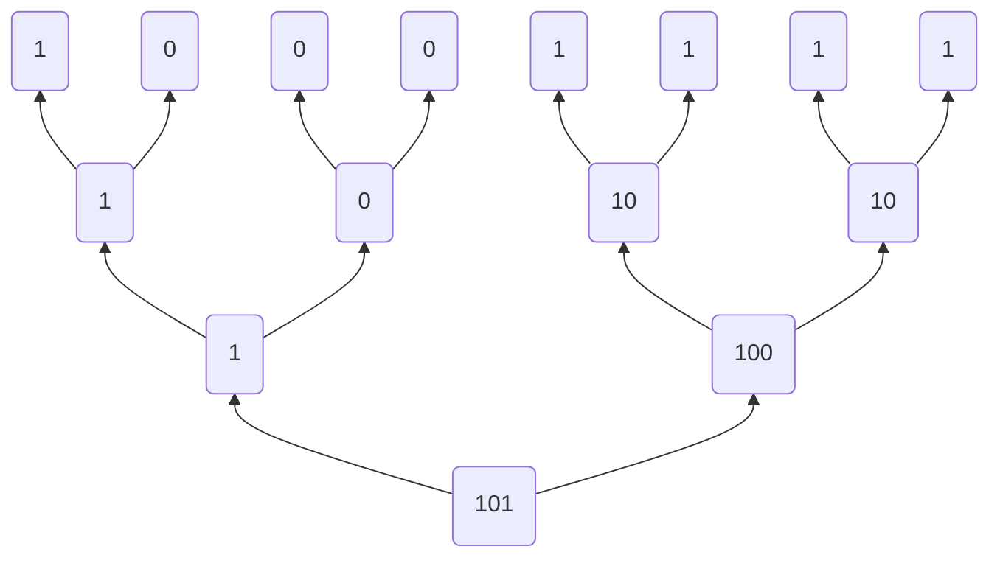

## 计算整数在二进制形式下1的个数

给定一个无符号32位整数, 计算它在二进制形式下1的个数

### 方法1

循环地检查每一位是否为1, 并计数.

这个是最容易想到的方式， 但是需要循环32次, 性能开销过大

```go
// 计算无符号32位整数二进制形式下1的数量
func CountBits1(num uint32) (count int) {
	// 依次检查每一位是否为1, 并计数
	for num > 0 {
		if num&0b1 == 1 {
			count++
		}
		num >>= 1
	}
	return
}
```

### 方法2

从低位开始, 循环地清除1, 直到数字为0.

对于那些1的个数少的数字，可以大大降低循环的次数

```go
// 计算无符号32位整数二进制形式下1的数量
func CountBits2(num uint32) (count int) {
	// 循环地清除低位的1, 直到数字为0, 1的个数与循环次数一致
	for num > 0 {
		num &= num - 1
		count++
	}
	return
}
```

### 方法3

类似于归并排序的思想, 我们先将相邻的两个比特位相加, 然后将相邻的两个结果相加, 不断重复将相邻的结果相加，直至最后只剩下一个结果.

比如对于二进制数`0b10001111`, 如下图，可以计算出1的个数为5



```go
// 计算无符号32位整数二进制形式下1的数量
func CountBits3(num uint32) (count int) {
	num = num&0x55555555 + num>>1&0x55555555
	num = num&0x33333333 + num>>2&0x33333333
	num = num&0x0f0f0f0f + num>>4&0x0f0f0f0f
	num = num&0x00ff00ff + num>>8&0x00ff00ff
	num = num&0x0000ffff + num>>16&0x0000ffff
	return int(num)
}
```

### 性能测试

我们取固定的数`0b11001111110011111100111111001111`进行测试

通过benchmark的结果为:

```
➜  igos go test -bench=.
goos: linux
goarch: amd64
pkg: github.com/souhup/igos
BenchmarkCountBits1-4           87418681                13.5 ns/op
BenchmarkCountBits2-4           144392588                8.16 ns/op
BenchmarkCountBits3-4           1000000000               0.435 ns/op
PASS
```